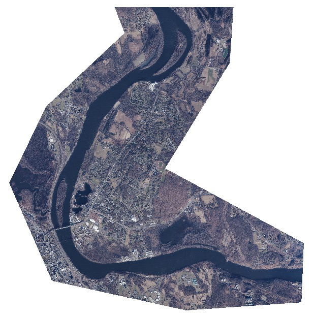
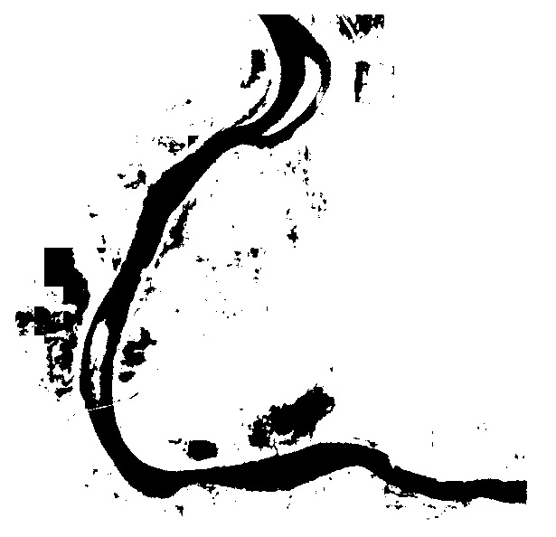

# About
This repository uses an ImageNet pre-trained model to fine-tune on 4-band satellite images for the task of water segmentation.
Using a few hand-labeled samples, we attempt to improve the performance on water segmentation.

Sample results:




Final results [here](https://drive.google.com/drive/folders/1Bw9MdeUwjlVLpP1C0h_4hDXbLo-H1XEG?usp=drive_link)
Takes 4 bands (RGB + NIR) as input, and outputs water mask of the same width and height as the input

# Training the Model
1. Download `segtrain_data.zip` and unzip to `segtrain_data` folder that contains training data from [here](https://drive.google.com/file/d/18HCXhSLyRXisK3F9091QnMONSJ8yMIZq/view?usp=drive_link)
2. Run the following to run the model training:
``` python train_seg.py --model_type "deeplab_mobilenet" --input_type "4band"```

# Running the model on new samples
1. Download pre-trained model [here](https://drive.google.com/file/d/1mA1xyg8h1pxWnBH53bAadadZxMw-zGxM/view?usp=drive_link)
2. Download sample data [here](https://drive.google.com/file/d/13tCaFVbkpGvNJxK-N9mslrQeaAn2QqZZ/view?usp=drive_link)
3. Run the following command.
```python eval_model.py --fp <path-to-tif-file>```
or 
```python eval_model.py --fp Connecticut_20230706_01.tif```
4. The predictions will be saved in the same folder as the input tif file. There will be three output files:
    - "*_pred.png" full size png of the predicted mask (takes longer to load)
    - "*_pred.png.jpg" smaller version of the predicted mask (you'd open this if you just want a quick peek at the output)
    - "*.tif" tif of the predicted mask
  
# Additional Experiments
1. Added a new inference script that can be run with:
   ```python eval_model_multiscale.py --fp <filepath to tif file> ```
3. In this script, instead of using a single crop size, you can use [multiple crop sizes](https://github.com/rangeldaroya/segment-water-4band/blob/30d22ab537152d62b30d3637bf977764723e83bd/eval_model_multiscale.py#L136). Changing the crop size changes how much context the model gets. The larger the crop size, the harder it is for the model to see finer details, but the smaller the crop size, it's harder for the model to contextualize where the water is.
    - Sometimes empty blocks were showing up since the cropped tile is too small and has a small view (e.g., the tile is all water pixels) so it can't predict all pixels as water. Instead of relying on a single crop size, we introduce multiple crops/scales and combine the result in one image.
  
NOTE: while this repository provides a way to roughly predict water pixels, more data would be needed to train a better model.